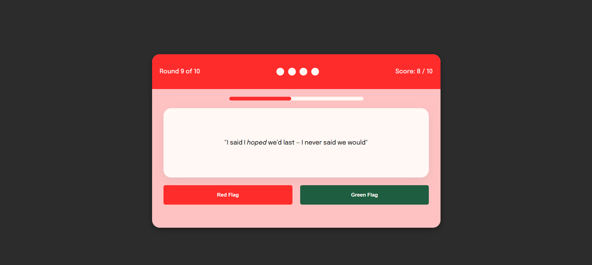

# Red Flags JavaScript Game 💌

Inspired by a post-breakup coffee chat with a friend, Red Flags is a browser-based quiz game that challenges players to recognize the difference between healthy and unhealthy relationship behaviors. Built with vanilla HTML, CSS, and JavaScript, the game presents users with common phrases and situations — your goal is to spot the red flags before you run out of chances.
The game was made purely for fun, and to help me improve my skills in JavaScript coding.

### Game Logic
Players are shown a random quote and must quickly determine if it represents a 'red flag' or a 'green flag'. They have 10 seconds to make each decision. Correct answers earn 1 point, while incorrect answers deduct it. The game ends after 4 incorrect responses. After each choice, players receive immediate feedback indicating whether their answer was correct. They can see the instructions on the landing page.

### Features I still have to add:
- [x] timer bar
- [ ] displaying lives
- [ ] format feedbacks

### A screenshot of the project:

